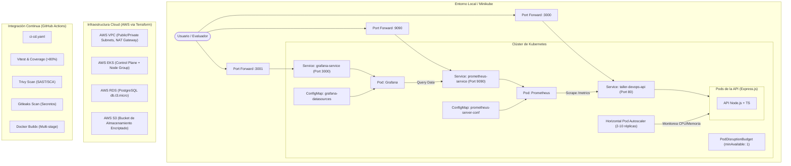

# 🏗️ Documentación de Arquitectura e Infraestructura

Este documento describe detalladamente la arquitectura del sistema, el flujo de desarrollo, la tubería de CI/CD (DevSecOps), la configuración de infraestructura como código (IaC) y el stack de observabilidad de la aplicación **TallerDevOps API**.

---

## 🗺️ 1. Diagrama de Arquitectura del Sistema

El siguiente diagrama representa cómo interactúan los componentes dentro del entorno local de Kubernetes (Minikube), la nube proyectada en AWS y el flujo automatizado de CI/CD:



---

## 🛠️ 2. Descripción de Componentes

### 💻 2.1 API de Node.js & TypeScript
Construida con **Express** y **TypeScript**. Incorpora las mejores prácticas para entornos en la nube:
* **Pruebas de Calidad**: Cobertura superior al 80% usando **Vitest** y **Supertest** para asegurar estabilidad funcional en cada entrega.
* **Observabilidad (Métricas)**: Expone métricas de rendimiento en formato Prometheus (`/metrics`) incluyendo uso de recursos (memoria/CPU) e histogramas de latencia de peticiones HTTP.
* **Resiliencia (Kubernetes Probes)**: Endpoints de `/health` (Liveness) y `/ready` (Readiness) para determinar si la aplicación está en línea y lista para procesar tráfico.
* **Trazabilidad (Logs Estructurados)**: Los logs se emiten en formato JSON utilizando `winston` y se vinculan de manera transparente mediante un `trace_id` único inyectado con `AsyncLocalStorage`.

### 🛡️ 2.2 Pipeline DevSecOps (GitHub Actions)
Definido en `.github/workflows/ci-cd.yaml`, sigue el enfoque de seguridad "Shift Left":
* **Integración Continua (CI)**: Valida que el código compile, pase los tests y mantenga el umbral mínimo de cobertura de código.
* **Análisis de Vulnerabilidades (SAST/SCA)**: Implementa **Trivy** para analizar librerías de código y detectar fallas de seguridad conocidas.
* **Escaneo de Secretos**: Utiliza **Gitleaks** para prevenir que credenciales y contraseñas sean confirmadas en el repositorio.
* **Empaquetado (Dockerization)**: Construcción automatizada mediante **Docker Buildx** optimizando el almacenamiento con builds multi-stage.

### 🏗️ 2.3 Infraestructura como Código (Terraform)
Ubicada en el directorio `/terraform`, aprovisiona de forma modular:
* **VPC**: Red aislada con subnets públicas/privadas, Internet Gateway, NAT Gateway y enrutamiento seguro.
* **EKS**: Clúster de Kubernetes gestionado por AWS con Node Groups auto-escalables (`t3.medium`).
* **RDS**: Base de datos de PostgreSQL con aislamiento de red que solo permite tráfico entrante desde la VPC.
* **S3**: Bucket encriptado y versionado para resguardo de objetos.
* **Backend Remoto**: Configurado para guardar el estado de forma segura en un bucket S3 con bloqueos concurrentes concurrentes (State Locking) a través de una tabla de DynamoDB (comentado temporalmente para permitir pruebas offline con **LocalStack**).

### ☸️ 2.4 Orquestación y Resiliencia en Kubernetes
Manifiestos YAML en `/k8s` enfocados en la alta disponibilidad:
* **Horizontal Pod Autoscaler (HPA)**: Escala dinámicamente de **2 a 10 réplicas** si el consumo de CPU supera el 70% o la Memoria supera el 80%.
* **PodDisruptionBudget (PDB)**: Garantiza que al menos 1 Pod esté disponible en cualquier actualización rodante (*Rolling Update*) o mantenimiento del clúster.
* **Secrets y ConfigMaps**: Desacopla credenciales sensibles y variables de entorno del código ejecutable.

### 📊 2.5 Stack de Observabilidad
Manifiestos YAML en `k8s/observability.yaml` para despliegue local de:
* **Prometheus**: Recolecta métricas cada 5 segundos directamente de los Pods de la API.
* **Grafana**: Panel gráfico pre-configurado para conectarse a Prometheus y desplegar dashboards de SLOs sobre tasa de errores y latencia.

---

## 🚀 3. Guía de Inicio Rápido (Local)

1. **Compilar y Cargar la imagen**:
   ```bash
   docker build -t taller-devops-api:latest .
   minikube image load taller-devops-api:latest
   ```

2. **Desplegar la Aplicación**:
   ```bash
   kubectl apply -f k8s/deployment.yaml
   ```

3. **Desplegar la Observabilidad**:
   ```bash
   kubectl apply -f k8s/observability.yaml
   ```

4. **Acceder a los Servicios (Port-Forward)**:
   * **API** (`http://localhost:3000`): `kubectl port-forward svc/taller-devops-api 3000:80`
   * **Grafana** (`http://localhost:3001`): `kubectl port-forward svc/grafana-service 3001:3000`
   * **Prometheus** (`http://localhost:9090`): `kubectl port-forward svc/prometheus-service 9090:9090`
